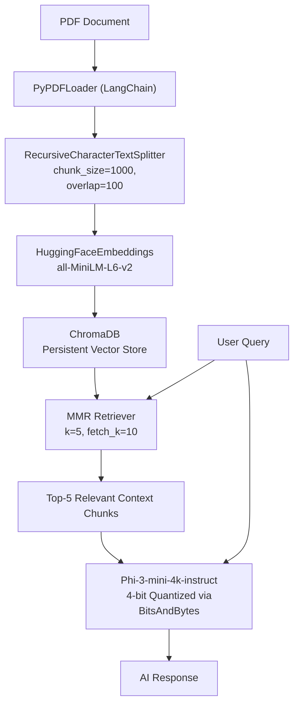
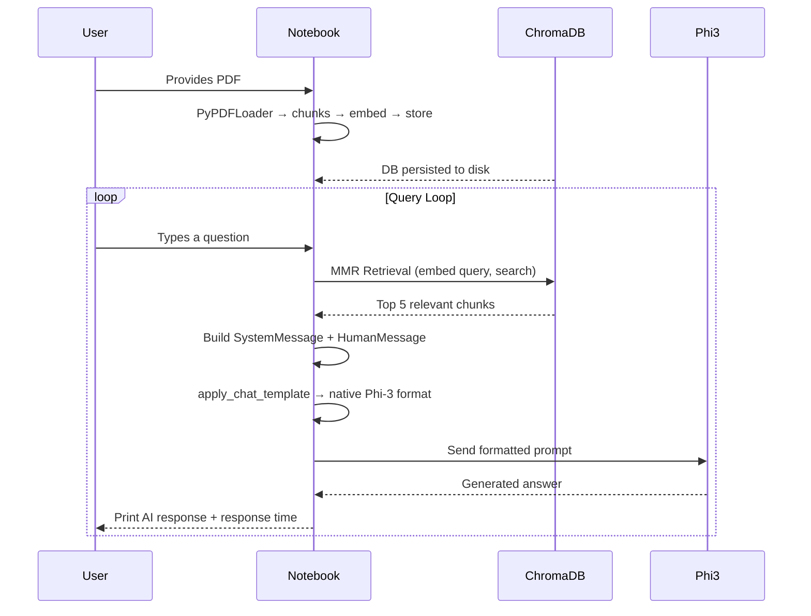

# RAG Pipeline Chatbot — Code Walkthrough & Optimization Guide

This document explains every line of `chatBot.ipynb` in detail, describes the overall workflow, and suggests code improvements.

---

## System Architecture Overview



---

## Cell-by-Cell Code Explanation

---

### Cell 1 — Install Dependencies

```python
!pip install -q langchain langchain-community langchain-huggingface chromadb bitsandbytes \
             accelerate sentence-transformers pypdf python-dotenv torch transformers
```

| Package | Purpose |
|---|---|
| `langchain` | Core LangChain framework for chaining LLM components |
| `langchain-community` | Community integrations (Chroma vector store, PyPDFLoader) |
| `langchain-huggingface` | LangChain wrapper for HuggingFace models and embeddings |
| `chromadb` | Persistent vector database for storing embeddings |
| `bitsandbytes` | Enables 4-bit quantization to reduce GPU VRAM usage |
| `accelerate` | HuggingFace library for efficient model loading and `device_map` |
| `sentence-transformers` | Required by `all-MiniLM-L6-v2` embedding model |
| `pypdf` | PDF parsing backend used by `PyPDFLoader` |
| `python-dotenv` | Loads environment variables from `.env` files |
| `torch` | PyTorch deep learning framework |
| `transformers` | HuggingFace model loaders and tokenizers |

> The `-q` flag suppresses verbose installation logs.

---

### Cell 2 — PDF Upload Handler (Google Colab)

```python
from google.colab import files      # Colab-specific file upload utility
import os                           # Standard OS module for path checks
```

```python
pdf_file = "test.pdf"               # Target filename for the PDF document
if not os.path.exists(pdf_file):    # Check if the PDF is already present
    print("Please upload your PDF file:")
    uploaded = files.upload()       # Opens a Colab file browser prompt to upload
    # Rename uploaded file to test.pdf if needed, or update pdf_file variable
```

**Line-by-line:**
- `from google.colab import files` — imports Colab's file utility; only works inside Google Colab.
- `pdf_file = "test.pdf"` — defines the filename variable used across the notebook.
- `os.path.exists(pdf_file)` — checks the Colab session's working directory; avoids re-upload if already there.
- `files.upload()` — opens a file picker dialog for the user to upload a local file.

> [!NOTE]
> The uploaded file key will match the original filename. If you upload `my_document.pdf`, rename it: `os.rename("my_document.pdf", "test.pdf")`.

---

### Cell 3 — Database Creation Module

#### Imports

```python
import os                                             # OS path operations
from langchain_huggingface import HuggingFaceEmbeddings   # Embedding model wrapper
from langchain_community.document_loaders import PyPDFLoader  # PDF loader
from langchain_text_splitters import RecursiveCharacterTextSplitter  # Text chunker
from langchain_community.vectorstores import Chroma   # Vector store
```

#### Singleton Embedding Model

```python
_embedding_model = None             # Module-level variable to store the loaded model
```

```python
def get_embedding_model():
    global _embedding_model         # Access the module-level variable
    if _embedding_model is None:    # Only load once (singleton pattern)
        _embedding_model = HuggingFaceEmbeddings(
            model_name="sentence-transformers/all-MiniLM-L6-v2"
            # Lightweight 22M parameter model; converts text to 384-dim vectors
        )
    return _embedding_model         # Return same instance on subsequent calls
```

**Why singleton?** Loading the embedding model downloads weights and allocates GPU/CPU memory. Without the singleton, the model would reload every time `get_embedding_model()` is called, wasting time and memory.

#### Vector DB Builder

```python
def build_vector_db(pdf_path: str, persist_dir: str):
```
Accepts:
- `pdf_path` — file path to the PDF document
- `persist_dir` — directory path where ChromaDB will save its data on disk

```python
    if not os.path.exists(pdf_path):       # Guard: check the file exists
        print(f"Error: PDF file not found at {pdf_path}")
        return None                        # Return None to signal failure

    emb_model = get_embedding_model()      # Get (or reuse) the embedding model
```

```python
    print(f"Loading document: {pdf_path}...")
    loader = PyPDFLoader(pdf_path)         # Initialize the PDF loader
    docs = loader.load()                   # Parse PDF; returns a list of Document objects
                                           # Each Document = one page with page_content and metadata
```

```python
    print("Splitting document into chunks...")
    splitter = RecursiveCharacterTextSplitter(
        chunk_size=1000,   # Max characters per chunk (~200 tokens)
        chunk_overlap=100  # Overlap between consecutive chunks to preserve context
    )
    chunks = splitter.split_documents(docs)
    # Splits Document objects into smaller chunks; preserves metadata
    # Recursive strategy: tries to split on "\n\n", then "\n", then " ", then character
```

```python
    if chunks:                             # Proceed only if chunks were created
        print(f"Storing {len(chunks)} chunks into vector DB at '{persist_dir}'...")
        vectorstore = Chroma.from_documents(
            documents=chunks,             # List of chunked Document objects
            embedding=emb_model,          # Embedding model to convert chunks to vectors
            persist_directory=persist_dir # Path for saving the DB to disk
        )
        # Internally: embeds each chunk → stores (vector, text, metadata) in ChromaDB
        print("Chunks stored successfully!")
        return vectorstore                # Return the Chroma vectorstore object
    else:
        print("No chunks created.")
        return None
```

---

### Cell 4 — LLM Initialization Module

#### Imports

```python
from transformers import AutoTokenizer, AutoModelForCausalLM, pipeline
# AutoTokenizer    — auto-detects and loads correct tokenizer for the model
# AutoModelForCausalLM — loads a decoder-only causal language model
# pipeline         — HuggingFace high-level API for text generation

from langchain_huggingface import HuggingFacePipeline
# Wraps a HuggingFace pipeline to make it compatible with LangChain's LLM interface

import torch
from transformers import BitsAndBytesConfig
# BitsAndBytesConfig — configures quantization (4-bit/8-bit) using bitsandbytes library
```

#### Quantization Config

```python
quantization_config = BitsAndBytesConfig(
    load_in_4bit=True,                      # Load model weights in 4-bit precision
    bnb_4bit_compute_dtype=torch.float16,   # Use FP16 for actual math during inference
    bnb_4bit_quant_type="nf4",              # NormalFloat4: better distribution for LLM weights
)
# Reduces Phi-3-mini VRAM from ~7GB (FP16) → ~2GB (4-bit), fits on T4 (16GB)
```

#### LLM Loader

```python
def get_llm():
    model_id = "microsoft/Phi-3-mini-4k-instruct"
    # HuggingFace model ID; "4k" = 4096 token context window, "instruct" = chat fine-tuned
```

```python
    tokenizer = AutoTokenizer.from_pretrained(
        model_id,
        clean_up_tokenization_spaces=False
        # Disables post-processing that strips spaces before punctuation
        # BPE tokenizers (like Phi-3's) don't need this; enabling it corrupts output
    )

    if tokenizer.pad_token is None:
        tokenizer.pad_token = tokenizer.eos_token
        # Phi-3's tokenizer has no dedicated pad token
        # Re-using EOS as pad token prevents generation warnings
```

```python
    model = AutoModelForCausalLM.from_pretrained(
        model_id,
        torch_dtype=torch.float16,          # Load weights in FP16 (halves memory vs FP32)
        quantization_config=quantization_config,  # Apply 4-bit NF4 quantization on top
        device_map="auto"                   # Automatically places layers across GPU/CPU
    )

    model.generation_config.max_length = None
    # Phi-3's default generation_config has max_length=20
    # This conflicts with max_new_tokens=300 and causes a warning
    # Setting to None disables the conflict
```

```python
    pipe = pipeline(
        task="text-generation",             # Type of generation task
        model=model,                        # The loaded Phi-3 model
        tokenizer=tokenizer,                # Paired tokenizer
        max_new_tokens=300,                 # Max tokens the model can generate per response
        return_full_text=False,             # Return ONLY generated text, not input prompt
        pad_token_id=tokenizer.eos_token_id # Suppress padding-related generation warnings
    )
```

```python
    return HuggingFacePipeline(pipeline=pipe)
    # Wraps the native HuggingFace pipeline into a LangChain-compatible LLM object
    # Allows use with LangChain chains and invoke() calls

llm = get_llm()                    # Instantiate and load the LLM
embedding_model = get_embedding_model()  # Reuse singleton embedding model
```

---

### Cell 5 — Main RAG Query Loop

#### Setup

```python
import time                                       # For measuring response latency
from langchain_core.messages import SystemMessage, HumanMessage
# LangChain message classes for structured multi-role prompts

pdf_file = "test.pdf"
db_directory = "chroma_DB_01"
```

#### Database Loading

```python
if not os.path.exists(db_directory):
    print("Building Vector Database from PDF...")
    build_vector_db(pdf_file, db_directory)
# Builds the DB from scratch only on first run; skips if already persisted
```

```python
vectorstore = Chroma(
    persist_directory=db_directory,
    embedding_function=embedding_model   # Must use same model used during build
)
# Loads the existing ChromaDB from disk into memory for querying
```

```python
retriever_response = vectorstore.as_retriever(
    search_type="mmr",           # Maximal Marginal Relevance: balances relevance AND diversity
    search_kwargs={
        "k": 5,                  # Return top 5 final chunks to the LLM
        "fetch_k": 10,           # Fetch 10 candidates first, then apply MMR re-ranking
        "lambda_mult": 0.5       # Diversity factor: 0=max diversity, 1=max relevance
    }
)
# MMR prevents returning 5 near-identical chunks from the same page
```

#### Query Loop

```python
while True:
    query = input("You : ").strip()    # Read user input, remove leading/trailing spaces
    if query == "0":
        print("Goodbye!")
        break                          # Exit condition
    if not query:
        continue                       # Ignore empty inputs, re-prompt
```

#### Context Retrieval

```python
    docs = retriever_response.invoke(query)
    # Embeds the query using the same embedding model
    # Searches ChromaDB using MMR to find top-5 most relevant document chunks

    context = "\n\n".join([doc.page_content for doc in docs])
    # Concatenates the 5 retrieved chunk texts into a single string
    # Separated by double newlines for readability in the prompt
```

#### Prompt Construction

```python
    messages = [
        SystemMessage(
            content="You are a helpful AI assistant. Use only the provided context to answer "
                    "the question. If the answer is not present in the context, say: "
                    "'I could not find the answer in the documnet.'"
        ),
        # SystemMessage: defines the model's persona and behavioral rules
        HumanMessage(
            content=f"Context:\n{context}\n\nQuestion: {query}\n\n"
                    "Remember: Answer based ONLY on the context. If the answer is not present, "
                    "say 'I could not find the answer in the documnet.'"
        )
        # HumanMessage: provides context + query + a reminder constraint at the end
        # Reminder at the end leverages the model's recency bias to enforce rules
    ]
```

```python
    formatted_messages = [
        {"role": "system" if isinstance(msg, SystemMessage) else "user", "content": msg.content}
        for msg in messages
    ]
    # Converts LangChain message objects → standard role-content dictionaries
    # Required format for tokenizer.apply_chat_template()
```

```python
    tokenizer = llm.pipeline.tokenizer
    final_prompt = tokenizer.apply_chat_template(
        formatted_messages,
        tokenize=False,            # Return a string, not token IDs
        add_generation_prompt=True # Appends "<|assistant|>" at the end to trigger generation
    )
    # Formats the messages using Phi-3's native chat template:
    # <|system|>...<|end|><|user|>...<|end|><|assistant|>
    # This is critical — without native tokens, the model generates multiple hallucinated turns
```

#### Inference

```python
    start_time = time.perf_counter()    # High-resolution timer start
    response = llm.invoke(final_prompt) # Send the formatted prompt to Phi-3 for generation
    end_time = time.perf_counter()      # Timer end

    print(f"\nAI : {response.strip()}")  # Strip leading/trailing whitespace from response
    print(f"\nResponse Time: {end_time - start_time:.2f} seconds\n")
```

---

## End-to-End Pipeline Workflow



---

## Code Optimization Suggestions

### Performance

| Area | Current | Suggestion |
|---|---|---|
| `max_new_tokens` | `300` | Lower to `150–200` for faster responses on T4 if answers are typically short |
| Retriever `k` | `5` | Try `k=3` to reduce context size and speed up inference |
| Retriever `fetch_k` | `10` | Try `fetch_k=15` for better MMR candidate diversity |
| Tokenizer access | Fetched every loop iteration: `llm.pipeline.tokenizer` | Move `tokenizer = llm.pipeline.tokenizer` **above** the while loop — it never changes |

### Memory

| Area | Suggestion |
|---|---|
| Quantization | Current NF4 4-bit is already optimal for T4. Avoid 8-bit unless accuracy degrades |
| Chunk size | Increase `chunk_size` to `1500` to reduce number of stored chunks and DB lookup time |
| Context joining | Limit `docs` to fewer chunks if response latency is high |

### Accuracy / Behavior

| Area | Issue | Suggestion |
|---|---|---|
| Typo in fallback | `"documnet"` appears in the prompt and response | Fix to `"document"` in `SystemMessage` and `HumanMessage` content |
| Embedding model | `all-MiniLM-L6-v2` is fast but low accuracy | For better retrieval, try `all-mpnet-base-v2` (slower, more accurate, 768-dim) |
| Chunk overlap | `chunk_overlap=100` | Increase to `150–200` for documents with dense cross-sentence dependencies |
| `lambda_mult` | `0.5` (balanced) | Try `0.7` to lean toward relevance if diversity causes off-topic retrieval |

### Code Quality

```python
# CURRENT (tokenizer fetched every loop iteration):
while True:
    ...
    tokenizer = llm.pipeline.tokenizer   # ← inside loop, wasteful

# OPTIMIZED (fetch once before the loop):
tokenizer = llm.pipeline.tokenizer       # ← outside loop
while True:
    ...
```

```python
# CURRENT (messages → formatted_messages two-step):
messages = [SystemMessage(...), HumanMessage(...)]
formatted_messages = [{"role": ..., "content": ...} for msg in messages]

# SIMPLIFIED (build dicts directly, remove dependency on isinstance):
formatted_messages = [
    {"role": "system", "content": "...system prompt..."},
    {"role": "user",   "content": f"Context:\n{context}\n\nQuestion: {query}\n\nRemember: ..."},
]
# Removes the need for importing SystemMessage/HumanMessage if not used elsewhere
```

> [!TIP]
> For production use on Colab, consider using `google.colab.output.eval_js` or `ipywidgets` to create a chat-style UI instead of a raw `input()` loop, which can behave inconsistently in notebooks.

> [!WARNING]
> The `langchain-community` package is being sunset. Migrate `Chroma` to `from langchain_chroma import Chroma` and `PyPDFLoader` to `from langchain_community.document_loaders import PyPDFLoader` (already stable) for long-term compatibility.
