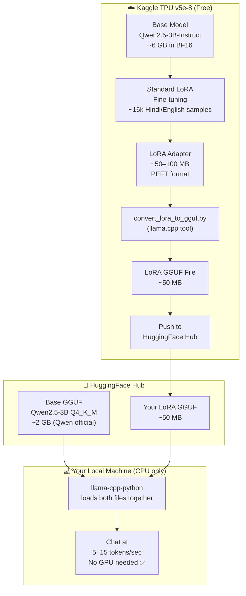

# Multilingual Chatbot — Complete Workflow & Architecture Guide

> **Who this is for:** Anyone who wants to understand how this project works end-to-end,
> from training on a Kaggle TPU to chatting on a local CPU with no GPU required.

---

## Table of Contents

1. [Project Goal](#1-project-goal)
2. [Big Picture Architecture](#2-big-picture-architecture)
3. [Precision Formats: BF16 vs FP16 vs FP32](#3-precision-formats-bf16-vs-fp16-vs-fp32)
4. [Training Strategy: QLoRA vs Standard LoRA](#4-training-strategy-qlora-vs-standard-lora)
5. [Hardware Requirements](#5-hardware-requirements)
6. [Dependency Map](#6-dependency-map)
7. [Step-by-Step Training Workflow (Kaggle TPU)](#7-step-by-step-training-workflow-kaggle-tpu)
8. [Config Parameters Explained](#8-config-parameters-explained)
9. [Step-by-Step CPU Inference Workflow](#9-step-by-step-cpu-inference-workflow)
10. [File Structure Reference](#10-file-structure-reference)
11. [Common Errors & Fixes](#11-common-errors--fixes)

---

## 1. Project Goal

Train a **Qwen2.5-3B-Instruct** language model to speak fluent **Hindi, English, and Hinglish**
(Hindi-English code-mix) — and run it **for free on your local CPU** using no GPU at all.

**The trick:** Train on Kaggle's free TPU (128 GB memory), export only a tiny LoRA adapter
(~50 MB), and combine it at runtime with a pre-quantized base model from HuggingFace.

---

## 2. Big Picture Architecture



### Why two separate files at inference?

The base model (`~2 GB`) never changes — it's the same Qwen model for everyone.
Only your **LoRA adapter** (~50 MB) contains your multilingual fine-tuning.
This means you only need to upload and download ~50 MB instead of ~2 GB.

---

## 3. Precision Formats: BF16 vs FP16 vs FP32

This is one of the most important concepts in modern ML. Every number stored in the model
takes a certain number of bits. Fewer bits = less memory, but less precision.

### What the numbers mean

```
FP32  (32-bit float): ████████████████████████████████  (1 sign + 8 exp + 23 mantissa)
FP16  (16-bit float): ████████████████                  (1 sign + 5 exp + 10 mantissa)
BF16  (16-bit bfloat): ████████████████                 (1 sign + 8 exp + 7 mantissa)
INT8  (8-bit int):    ████████                           (quantized integer)
INT4  (4-bit int):    ████                               (quantized integer, QLoRA uses this)
```

### Side-by-side Comparison

| Feature | FP32 | FP16 | BF16 | INT4 (QLoRA) |
|---------|------|------|------|--------------|
| **Bits per number** | 32 | 16 | 16 | 4 |
| **Memory for 3B model** | ~12 GB | ~6 GB | ~6 GB | ~1.5 GB |
| **Exponent bits** | 8 | 5 | 8 | — |
| **Mantissa bits** | 23 | 10 | 7 | — |
| **Dynamic range** | Very wide | Narrow ⚠️ | Same as FP32 ✅ | Fixed ranges |
| **Precision** | Highest | High | Medium | Low |
| **Overflow risk** | None | High (NaN/Inf) | Low ✅ | N/A |
| **Hardware support** | All | NVIDIA Turing+ (T4, RTX) | TPU native ✅, NVIDIA Ampere+ | NVIDIA via bitsandbytes |
| **Training stable?** | ✅ Yes | ⚠️ Needs loss scaling | ✅ Yes (no scaling needed) | ⚠️ Adapter only |
| **Best use case** | Debugging | NVIDIA GPU training | TPU training | Memory-constrained GPU |

### Why BF16 is better than FP16 on TPU

> **The key difference is the exponent bits.**

- **FP16** has only 5 exponent bits → small dynamic range → gradients can overflow to `Inf` or underflow to `0` (called **gradient explosion/vanishing**). You need a special trick called **loss scaling** to fix this.
- **BF16** has 8 exponent bits (same as FP32) → same dynamic range as full precision → **gradients never overflow**. No loss scaling needed.
- TPU chips are physically designed to compute BF16 natively. Using FP16 on a TPU is like driving on the wrong side of the road — it works but isn't optimal.

```
FP16 danger:  gradient = 0.000012  →  underflows to 0.0  →  model stops learning ❌
BF16 safe:    gradient = 0.000012  →  stored correctly    →  model learns normally ✅
```

### When to use what

| Situation | Recommended |
|-----------|-------------|
| Kaggle TPU v5e-8 | **BF16** — native hardware support |
| NVIDIA T4 / RTX / A100 | **FP16** — well-supported with loss scaling |
| NVIDIA GTX 1650 Ti (4GB) | **FP16 + 4-bit QLoRA** — only way to fit in memory |
| Local CPU inference | **INT4 via GGUF** (Q4_K_M) — fastest on CPU |
| Debugging / accuracy tests | **FP32** — full precision |

---

## 4. Training Strategy: QLoRA vs Standard LoRA

### What is LoRA?

**LoRA (Low-Rank Adaptation)** is a technique where instead of updating all ~3 billion
parameters of the model, you freeze the original weights and add tiny **trainable adapter
matrices** to specific layers. Only ~0.5–1% of parameters are actually trained.

```
Original weight matrix W (frozen):        [3072 × 3072] = 9.4M params
LoRA adds two small matrices A and B:     [3072 × 16] + [16 × 3072] = 98K params
Effective update: W' = W + (A × B) × α/r
```

This saves enormous amounts of memory and makes training much faster.

### QLoRA = LoRA + 4-bit Quantization

**QLoRA** goes one step further: it loads the *frozen base model* in 4-bit integer format
(using `bitsandbytes`), which cuts memory from ~6 GB to ~1.5 GB. Then it trains the
LoRA adapters in FP16.

### Comparison Table

| Feature | Standard LoRA | QLoRA |
|---------|--------------|-------|
| Base model precision | FP16 or BF16 | 4-bit NF4 (frozen) |
| Memory (3B model) | ~6 GB | ~1.5–2 GB |
| Adapter precision | FP16 / BF16 | FP16 |
| Hardware required | Any GPU ≥ 6GB, or TPU | NVIDIA CUDA GPU only |
| `bitsandbytes` needed? | ❌ No | ✅ Yes (CUDA-only) |
| Training speed | Faster | Slightly slower (dequant overhead) |
| Output quality | ✅ Same | ✅ Same |
| Works on TPU? | ✅ Yes | ❌ No |

> **This project uses Standard LoRA + BF16 on TPU, and QLoRA + FP16 on GPU (local fallback).**
> The LoRA adapter output is identical in both cases — only the training memory usage differs.

---

## 5. Hardware Requirements

### Training (Kaggle — Free)

| Resource | Kaggle TPU v5e-8 | Kaggle T4 GPU (old) |
|----------|-----------------|---------------------|
| **Chips** | 8 TPU cores | 1 GPU |
| **Memory** | 8 × 16 GB = **128 GB HBM** | 16 GB VRAM |
| **Model fits in?** | BF16 (~6 GB) ✅ | 4-bit QLoRA (~2 GB) ✅ |
| **Batch size** | 16 per core × 8 = **128 total** | 4 (grad accum × 4 = 16 eff.) |
| **Expected training time** | ~30–60 min | ~60–90 min |
| **bitsandbytes support** | ❌ CUDA-only | ✅ Yes |
| **Precision** | BF16 | FP16 |
| **Cost** | Free (30 hrs/week) | Free (30 hrs/week) |

### Inference (Local — Your Machine)

| Resource | Required |
|----------|---------|
| **RAM** | ≥ 4 GB (model uses ~2.5 GB) |
| **GPU** | ❌ Not needed |
| **CPU** | Any modern CPU (AVX2 recommended for speed) |
| **Disk** | ~2.1 GB (2 GB base + 50 MB LoRA) |
| **Python** | 3.10+ |

---

## 6. Dependency Map

### Training Dependencies (Kaggle TPU)

```
torch               ← Pre-installed on Kaggle (DO NOT reinstall)
torch_xla           ← Pre-installed on Kaggle TPU (XLA = Accelerated Linear Algebra)
    └── Handles all TPU communication, parallelism across 8 cores

transformers        ← HuggingFace library: model architecture + tokenizer
    └── Loads Qwen2.5-3B-Instruct weights from HuggingFace Hub

peft                ← HuggingFace PEFT library
    └── Adds LoRA adapter layers (LoraConfig, get_peft_model)
    └── Saves adapter weights after training

trl                 ← HuggingFace TRL (Training with RL) library
    └── Not directly used but required by peft/transformers ecosystem

accelerate          ← HuggingFace Accelerate
    └── Handles multi-device training abstraction
    └── Works with xmp.spawn on TPU

tokenizers          ← Fast Rust-based tokenizer (pinned <=0.23.0 for compatibility)
datasets            ← HuggingFace Datasets (downloads ultrachat, IITB corpus)
sentencepiece       ← Tokenizer backend for multilingual models
huggingface-hub     ← Upload/download models from HuggingFace
scipy, tqdm         ← Math utilities, progress bars

bitsandbytes        ← ❌ NOT installed on TPU (CUDA-only)
                       ✅ Used on local GPU for QLoRA 4-bit quantization
```

### Inference Dependencies (Local CPU)

```
llama-cpp-python    ← Python wrapper around llama.cpp (C++ inference engine)
    └── Loads .gguf files natively
    └── Applies LoRA adapter on top of base model
    └── Uses AVX2/AVX512 CPU instructions for fast inference
    └── NO GPU, NO CUDA, NO torch needed

huggingface-hub     ← Download .gguf files from HuggingFace Hub
```

### Why we DON'T install torch for CPU inference

`llama-cpp-python` is a standalone C++ engine. It doesn't use PyTorch at all.
Installing torch for CPU inference would waste ~2 GB of disk and slow startup time.

---

## 7. Step-by-Step Training Workflow (Kaggle TPU)

### How to run

```python
# In your Kaggle TPU v5e-8 notebook:
!wget https://raw.githubusercontent.com/shubham075/model_tuning_01/main/kaggle_train.py
!python kaggle_train.py \
    --hf_token  "$HF_TOKEN" \
    --hf_repo   "your-username/qwen25-multilingual-lora-gguf" \
    --github_url "https://github.com/shubham075/model_tuning_01"
```

### Step 1 — Install Dependencies

**What happens:**
1. Checks if `torch_xla` is pre-installed (it always is on Kaggle TPU)
2. Installs `peft`, `transformers`, `tokenizers`, `trl` in one pip call (version co-resolution)
3. Installs `accelerate`, `datasets`, `sentencepiece`, `huggingface-hub`
4. Skips `bitsandbytes` entirely (not supported on TPU)

**Why co-resolve in one pip call?**
`peft`, `transformers`, `tokenizers`, and `trl` have strict mutual version constraints.
If installed separately, pip may upgrade `tokenizers` past 0.23.0, breaking `transformers`.
A single `pip install` call forces pip to find a compatible set all at once.

### Step 2 — Clone Repository

**What happens:**
- Clones your GitHub repo to `/kaggle/working/chatbot_multilingual/`
- Adds the repo and `src/` to `sys.path` so all modules can import each other

### Step 3 — Download & Preprocess Training Data

Three datasets are downloaded and merged:

| Dataset | Language | Samples | Source |
|---------|----------|---------|--------|
| UltraChat 200k | English | 8,000 | HuggingFace |
| IITB Parallel Corpus | Hindi | 5,000 | IITB Mumbai |
| Synthetic generation | Hinglish | 3,000 | Generated |
| **Total** | | **~16,000** | |

Each sample is formatted into a chat template:
```
<|im_start|>system
You are a helpful assistant who speaks Hindi, English, and Hinglish.
<|im_end|>
<|im_start|>user
[question]
<|im_end|>
<|im_start|>assistant
[answer]
<|im_end|>
```

### Step 4 — LoRA Fine-tuning (The Core Step)

**What happens internally:**

```
kaggle_train.py writes _kaggle_config_patch.py
    → Overrides config.py values for TPU:
        BATCH_SIZE = 16
        GRAD_ACCUMULATION_STEPS = 1
        BF16_TRAINING = True
        FP16_TRAINING = False
        MAX_SEQ_LENGTH = 1024

kaggle_train.py writes _kaggle_train_launcher.py
    → Uses xmp.spawn() to start training on ALL 8 TPU cores simultaneously

Each core runs train.main():
    1. model.py: load_for_training()
       → Detects TPU via torch_xla
       → Loads Qwen2.5-3B in BF16 (~6 GB total, ~750 MB per core)
       → Wraps with LoRA adapter (rank=16, alpha=32)
       → Only ~98K extra params per target layer are trainable

    2. dataset.py: MultilingualChatDataset
       → Loads train.jsonl and eval.jsonl
       → Tokenizes using Qwen tokenizer
       → Masks prompt tokens (only train on answer tokens)

    3. train.py: Trainer.train()
       → bf16=True, fp16=False, no_cuda=True
       → optim=adamw_torch (no bitsandbytes needed)
       → Runs for 3 epochs with early stopping (patience=5 evals)
       → Saves checkpoint every 200 steps
       → Best adapter saved to /kaggle/working/checkpoints/best_lora_adapter/
```

**What "effective batch size" means:**
```
Per-core batch:     16 samples
× TPU cores:      ×  8 cores
= Effective batch: 128 samples per gradient update
```
A larger effective batch = smoother gradients = more stable training.

### Step 5 — Convert LoRA Adapter → GGUF Format

**Why not merge the full model?**

| Approach | Size | Time | Disk needed |
|----------|------|------|-------------|
| Full merge (LoRA → FP16 → GGUF) | ~2 GB | ~30 min extra | ~12 GB |
| **LoRA-only GGUF (this project)** | **~50 MB** | **~5 min** | **~500 MB** |

**What happens:**
1. Clones `llama.cpp` from GitHub (depth=1, just latest commit)
2. Runs `convert_lora_to_gguf.py` — converts the PEFT adapter format to a llama.cpp-compatible GGUF LoRA file
3. The base model GGUF is already on HuggingFace — no conversion needed

### Step 6 — Push to HuggingFace Hub

- Logs in with your HF token
- Creates the repo if it doesn't exist
- Uploads `multilingual_lora.gguf` (~50 MB)
- Uploads a `README.md` explaining the two-file setup

---

## 8. Config Parameters Explained

```python
# ─── LoRA Hyperparameters ────────────────────────────────
LORA_R     = 16    # Rank: how many dimensions the adapter adds
                   # Higher rank → more capacity → more VRAM
                   # Common values: 8 (small), 16 (balanced), 64 (large)

LORA_ALPHA = 32    # Scaling factor = alpha/rank = 32/16 = 2.0
                   # Controls how strongly LoRA updates influence the output
                   # Rule of thumb: set to 2× the rank

LORA_DROPOUT = 0.05  # Prevents overfitting during training
                      # 5% of adapter neurons randomly zeroed each step

LORA_TARGET_MODULES = [
    "q_proj", "k_proj", "v_proj", "o_proj",  # Attention projections
    "gate_proj", "up_proj", "down_proj",       # FFN (feed-forward) projections
]
# Targeting ALL projections gives the best coverage of the model's behavior

# ─── Training Hyperparameters ────────────────────────────
MAX_SEQ_LENGTH = 512    # Local GPU default (limits memory)
                         # TPU patch sets this to 1024
                         # Longer = better conversation context, more memory

BATCH_SIZE     = 1      # Local: 1 (4GB VRAM limit)
                         # TPU patch: 16 per core (128 effective with 8 cores)

GRAD_ACCUMULATION_STEPS = 16  # Local: accumulate 16 steps → effective batch = 16
                                # TPU: 1 (no accumulation, already large batch)

LEARNING_RATE  = 2e-4   # Standard for LoRA fine-tuning
                          # Too high → unstable, too low → slow convergence

NUM_EPOCHS     = 3       # Full passes over the training data
                          # With early stopping, may stop earlier

WARMUP_RATIO   = 0.05   # First 5% of steps: LR ramps from 0 → LEARNING_RATE
                          # Prevents large gradient updates at the start

LR_SCHEDULER_TYPE = "cosine"  # LR decays following a cosine curve after warmup
                                # Smoother than linear decay for LLM fine-tuning

SAVE_STEPS     = 200    # Save checkpoint every 200 training steps
EVAL_STEPS     = 200    # Evaluate on eval set every 200 steps
LOGGING_STEPS  = 25     # Print training loss every 25 steps

FP16_TRAINING  = True   # Local GPU default (GTX 1650 Ti / T4)
BF16_TRAINING  = False  # TPU default (TPU patch sets this to True)
```

---

## 9. Step-by-Step CPU Inference Workflow

### One-time Setup

```bash
# Step 1: Install the inference engine (no torch, no GPU drivers)
pip install llama-cpp-python huggingface-hub

# For Windows (pre-compiled binary, no C++ compiler needed):
pip install llama-cpp-python --prefer-binary

# Step 2: Download the base model from Qwen's official HF repo (~2 GB)
huggingface-cli download Qwen/Qwen2.5-3B-Instruct-GGUF \
    qwen2.5-3b-instruct-q4_k_m.gguf \
    --local-dir ./models/

# Step 3: Download your fine-tuned LoRA adapter (~50 MB)
huggingface-cli download your-username/qwen25-multilingual-lora-gguf \
    multilingual_lora.gguf \
    --local-dir ./models/
```

### Starting the Chat

```bash
python chatbot_multilingual.py --mode cpu_chat \
    --base_gguf ./models/qwen2.5-3b-instruct-q4_k_m.gguf \
    --lora_gguf ./models/multilingual_lora.gguf
```

### What happens internally at inference time

```
1. llama-cpp-python loads base GGUF (Q4_K_M = 4-bit quantized, ~2 GB)
       └── Uses mmap() — file is memory-mapped, not fully loaded upfront
       └── Only layers actively used are paged into RAM

2. LoRA adapter loaded on top (~50 MB, kept in RAM)
       └── Applied as a delta: output = base_output + lora_output × scale

3. User sends a message
       └── Tokenized using Qwen tokenizer (built into the GGUF)
       └── System prompt prepended: "You are a helpful assistant..."
       └── Full context: [system][history][user_message]

4. Model generates response token by token
       └── Each token: one forward pass through all 28 layers
       └── Uses AVX2 CPU instructions (vectorized math, 8 floats at once)
       └── Speed: 5–15 tokens/sec on Ryzen 6700H

5. Output decoded and printed in real-time (streaming)
```

### Q4_K_M Quantization Explained

`Q4_K_M` is a specific GGUF quantization scheme:
- **Q4** = 4-bit integers (weights stored as 4-bit)
- **K** = K-quantization (groups of 32 values share a scale factor, better accuracy)
- **M** = Medium (balance between speed and accuracy; also available: S=small, L=large)

```
FP32 weight: 0.12847362...  (32 bits, full precision)
Q4_K_M:      [scale=0.13, offset=0.01, value=5]  (≈4 bits effective)

Memory saved: 32 bits → 4 bits = 8× compression
Quality loss: ~1-2% perplexity increase (barely noticeable in chat)
```

---

## 10. File Structure Reference

```
chatbot_multilingual/
│
├── kaggle_train.py          ← Run this on Kaggle TPU. Orchestrates all 6 steps.
├── chatbot_multilingual.py  ← Entry point for local inference and data download
├── config.py                ← All hyperparameters. TPU patch overrides these at runtime.
├── requirements.txt         ← GPU training dependencies (local)
├── requirements_cpu.txt     ← CPU inference only (3 packages)
│
├── src/
│   ├── model.py             ← Model loading. Auto-detects TPU/GPU and picks strategy.
│   ├── train.py             ← HuggingFace Trainer loop. TPU-aware (bf16, no_cuda).
│   ├── dataset.py           ← Multilingual dataset loader + chat formatting
│   ├── inference.py         ← GPU inference (HuggingFace generate)
│   ├── inference_cpu.py     ← CPU inference via llama-cpp-python + GGUF
│   └── preprocess.py        ← Data download and preprocessing pipeline
│
├── data/
│   ├── raw/                 ← Downloaded raw datasets (ultrachat, IITB, etc.)
│   └── processed/           ← train.jsonl, eval.jsonl (chat-formatted)
│
├── models/                  ← Downloaded GGUF files go here (gitignored)
├── checkpoints/             ← LoRA adapter saved during training (gitignored)
└── logs/                    ← Training logs (gitignored)
```

### Auto-generated files (Kaggle only, not committed)

```
/kaggle/working/
├── _kaggle_config_patch.py      ← Written by step4, overrides config for TPU
├── _kaggle_train_launcher.py    ← Written by step4, uses xmp.spawn for 8 cores
├── checkpoints/best_lora_adapter/  ← Saved LoRA adapter weights
├── multilingual_lora.gguf       ← Final GGUF file (uploaded to HF)
└── /tmp/llama.cpp/              ← Cloned for GGUF conversion tool
```

---

## 11. Common Errors & Fixes

| Error | Cause | Fix |
|-------|-------|-----|
| `bitsandbytes CUDA error` on TPU | bitsandbytes installed but no CUDA on TPU | ✅ Already fixed: not installed on TPU |
| `TPU not found` / `RuntimeError: xla_device` | torch_xla not available | Check TPU is selected in Kaggle settings |
| `tokenizers version conflict` | tokenizers >0.23.0 breaks transformers | ✅ Fixed: pinned `tokenizers<=0.23.0` |
| `OOM during model load on TPU` | Model too large for a single core | ✅ Fixed: loaded once then `.to(device)` |
| `convert_lora_to_gguf.py not found` | Old version of llama.cpp | Run `git -C /tmp/llama.cpp pull` to update |
| `push declined (secret scanning)` | API token committed to git | Revoke token, use `git filter-repo --replace-text` |
| `llama-cpp-python install fails (Windows)` | Needs C++ compiler | `pip install llama-cpp-python --prefer-binary` |
| `Slow inference (<3 tok/s)` | Too many CPU threads (using logical cores) | Set `CPU_N_THREADS` to physical cores only |
| `OOM during GGUF conversion (Step 5)` | Not enough disk on Kaggle | Restart session, run `--start_from 5` |

---

## Quick Reference: Training vs Inference at a Glance

```
┌─────────────────────────────────┬──────────────────┬──────────────────┐
│ What                            │ Training (Kaggle) │ Inference (Local) │
├─────────────────────────────────┼──────────────────┼──────────────────┤
│ Hardware                        │ TPU v5e-8        │ Any CPU          │
│ Python packages                 │ torch, torch_xla │ llama-cpp-python │
│ Model precision                 │ BF16             │ Q4_K_M GGUF     │
│ Model size in memory            │ ~6 GB (128 GB avail) │ ~2.5 GB RAM │
│ Quantization                    │ None (bf16)      │ 4-bit GGUF      │
│ LoRA method                     │ Standard LoRA    │ N/A (inference)  │
│ bitsandbytes                    │ ❌ Not used      │ ❌ Not needed   │
│ Parallelism                     │ 8 cores (xmp.spawn) │ Multi-thread │
│ Speed                           │ ~30–60 min train │ 5–15 tok/sec    │
│ Cost                            │ Free (Kaggle)    │ Free (your CPU) │
└─────────────────────────────────┴──────────────────┴──────────────────┘
```
